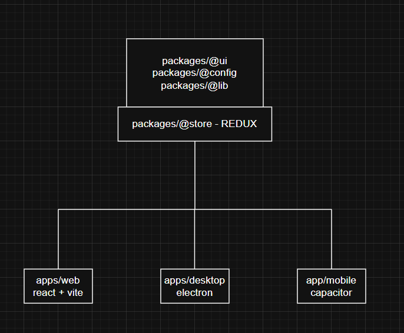

# BARIA-MVP (Web / Desktop / Mobile)

## Quick Start
```bash
pnpm i

# Web
pnpm dev:web

# Desktop (Electron)
pnpm dev:desktop

# Mobile (Android via Capacitor)
pnpm mobile:android # builds web, syncs capacitor, opens Android Studio

# Mobile (Ios via Capacitor Not tested yet)
pnpm mobile:ios 

## Overview
Stack: 
React + Vite (web)
Electron (desktop)
Capacitor/Android (mobile)
TypeScript
Redux Toolkit (@store)
Tailwind CSS

State & sessions:
Each app/tab/window runs its own Redux store;
global state lives in packages/@store (ui, auth, data, settings) via Provider/dispatch/useSelector;
no cross-session sharing;

```
<p align="center">
  
</p>